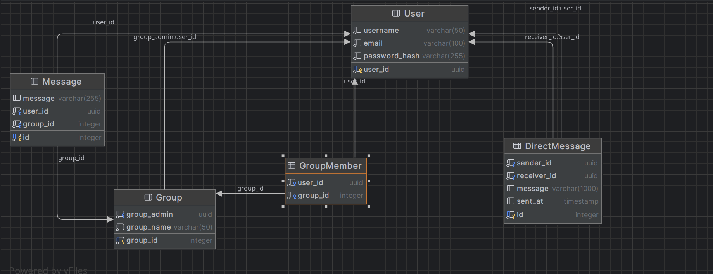

## Backend LokkerRoom

  

[Link to live version](https://lokkerroom-d7516.web.app/)

  

### Description :

  

A chat room app created using React for the frontend([repo link](https://github.com/asakshat/frontend_lokker)) and an express server as a backend with Postgresql.

  

---

### Guide

- Make sure to npm install before you start
- Make sure your **.env** file has the proper values
 i.e :- `SECRET = <YOUR-SECRET-CODE>`  & `PORT = <YOUR PORT>`

- To execute any sql query inside js file just use executeQuery (Parameterized queries)
 Example :- `executeQuery('SELECT $1 FROM "User",[user_id]')`

 ### DATABASE SCHEMA 
 

### Auth Endpoints

  

<!-- prettier-ignore -->

| Endpoint      | Description |
| ------------- | ----------- |
| `/api/user/login` | User login   |
| `/api/user/signup` | User signup |

  

### Admin Routes

  

<!-- prettier-ignore -->
| Endpoint                           | Description        |
| ---------------------------------- | ------------------ |
| `/api/admin/createGroup/:group_admin` | Create a group     |
| `/api/admin/deletemessage/:group_id/:message_id` | Delete a message |

  

### Other API's within the code itself
